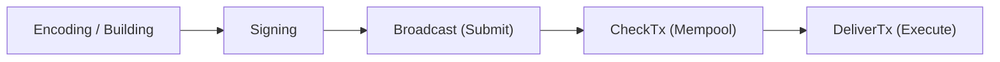

CosmJS surfaces errors at every stage of a transaction's lifecycle — from
building and signing through broadcasting and on-chain execution.



| Stage | Error source |
| --- | --- |
| Encoding / Building | Registry & encoding errors |
| Signing | Key & wallet errors |
| Broadcast (Submit) | Transport errors |
| CheckTx (Mempool) | `BroadcastTxError` |
| DeliverTx (Execute) | Execution errors |

CosmJS defines two dedicated error classes for the broadcast/execution lifecycle.
All other errors are thrown as plain `Error` instances with descriptive messages.

## `TimeoutError`

Thrown when a transaction is successfully submitted to the node but is not
included in a block before the timeout expires (default: 60 seconds). The
transaction may still succeed later.

```typescript
import { TimeoutError } from "@cosmjs/stargate";

class TimeoutError extends Error {
  public readonly txId: string;
}
```

The `txId` property lets you query the transaction later:

```typescript
try {
  const result = await client.broadcastTx(txBytes);
} catch (error) {
  if (error instanceof TimeoutError) {
    // Transaction was submitted — check later
    const tx = await client.getTx(error.txId);
  }
}
```

You can increase the timeout when broadcasting:

```typescript
const result = await client.broadcastTx(txBytes, 120_000); // 120 seconds
```

Or set it globally via client options:

```typescript
const client = await SigningStargateClient.connectWithSigner(endpoint, signer, {
  broadcastTimeoutMs: 120_000,
  broadcastPollIntervalMs: 5_000,
});
```

## `BroadcastTxError`

Thrown when the node rejects a transaction during **CheckTx** — before the
transaction enters the mempool. This is a definitive rejection; the transaction
will not be included in a block.

```typescript
import { BroadcastTxError } from "@cosmjs/stargate";

class BroadcastTxError extends Error {
  public readonly code: number;
  public readonly codespace: string;
  public readonly log: string | undefined;
}
```

Common causes include invalid addresses, insufficient fees, badly formed
messages, and sequence mismatches:

```typescript
try {
  const result = await client.signAndBroadcast(address, messages, fee);
} catch (error) {
  if (error instanceof BroadcastTxError) {
    console.error(`Rejected (code ${error.code}, codespace: ${error.codespace})`);
    console.error("Log:", error.log);
  }
}
```
