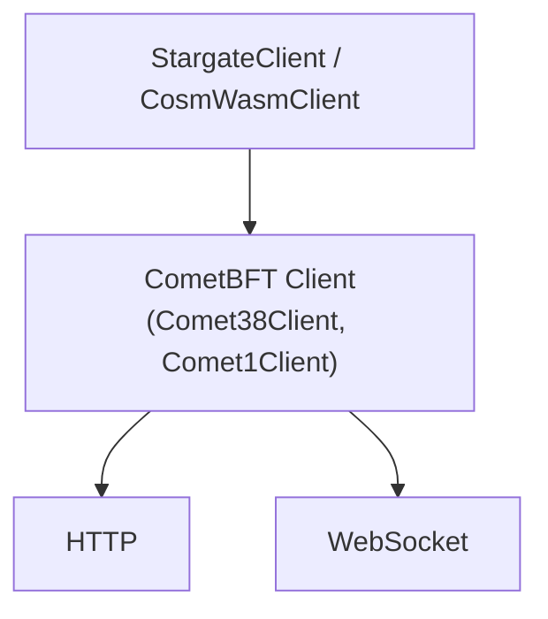

CosmJS communicates with Cosmos SDK chains through
[Tendermint/CometBFT RPC](https://docs.cometbft.com/v1/spec/rpc/). The
transport layer sits between the high-level clients (`StargateClient`,
`CosmWasmClient`) and the blockchain node, handling request encoding, response
parsing, connection management, and event subscriptions.



All transports implement the same `RpcClient` interface from
`@cosmjs/tendermint-rpc`, so the upper layers are transport-agnostic.

## RpcClient & RpcStreamingClient

Every transport implements at least `RpcClient`:

```typescript
interface RpcClient {
  readonly execute: (request: JsonRpcRequest) => Promise<JsonRpcSuccessResponse>;
  readonly disconnect: () => void;
}
```

Transports that support event subscriptions additionally implement
`RpcStreamingClient`:

```typescript
interface RpcStreamingClient extends RpcClient {
  readonly listen: (request: JsonRpcRequest) => Stream<SubscriptionEvent>;
}
```

You can check at runtime with `instanceOfRpcStreamingClient(client)`.

## Automatic Transport Selection

When you call `StargateClient.connect(endpoint)` or `connectComet(endpoint)`,
the transport is selected based on the URL protocol:

| Endpoint | Transport |
|----------|-----------|
| `http://...` or `https://...` | `HttpClient` |
| `ws://...` or `wss://...` | `WebsocketClient` |
| `HttpEndpoint` object | `HttpClient` (always) |

```typescript
// HTTP transport (default for most use cases)
const client = await StargateClient.connect("https://rpc.cosmos.network");

// WebSocket transport (needed for subscriptions)
const client = await StargateClient.connect("wss://rpc.cosmos.network");
```

## Manual Transport Configuration

The automatic `connect()` methods don't expose transport-level options like
timeouts or batching. For full control, construct the RPC client manually and
pass it through the `create()` factory:

```typescript
import { StargateClient } from "@cosmjs/stargate";
import { Comet38Client, HttpClient } from "@cosmjs/tendermint-rpc";

// HTTP with 15-second timeout
const rpcClient = new HttpClient("https://rpc.cosmos.network", 15_000);
const cometClient = await Comet38Client.create(rpcClient);
const client = StargateClient.create(cometClient);
```

```typescript
import { StargateClient } from "@cosmjs/stargate";
import { Comet38Client, HttpBatchClient } from "@cosmjs/tendermint-rpc";

// Batched HTTP with custom options
const rpcClient = new HttpBatchClient("https://rpc.cosmos.network", {
  batchSizeLimit: 10,
  dispatchInterval: 50,
  httpTimeout: 15_000,
});
const cometClient = await Comet38Client.create(rpcClient);
const client = StargateClient.create(cometClient);
```

<Tip>
When using manual transport configuration, you need to know the CometBFT version of your target chain. Use `Comet38Client` for CometBFT 0.38, `Comet1Client` for CometBFT 1.x, or `Tendermint37Client` for Tendermint 0.37. If you're not sure, use `connectComet()` for auto-detection — though this only accepts an endpoint string or `HttpEndpoint`, not a pre-built RPC client.
</Tip>

## Package Summary

| Package | Role |
|---------|------|
| `@cosmjs/tendermint-rpc` | RPC client implementations (`HttpClient`, `HttpBatchClient`, `WebsocketClient`) and CometBFT client wrappers |
| `@cosmjs/json-rpc` | JSON-RPC 2.0 types, parsing, and ID generation |
| `@cosmjs/socket` | WebSocket wrapper with reconnection, queueing, and connection status |
| `@cosmjs/stream` | Reactive stream utilities (xstream-based) |
