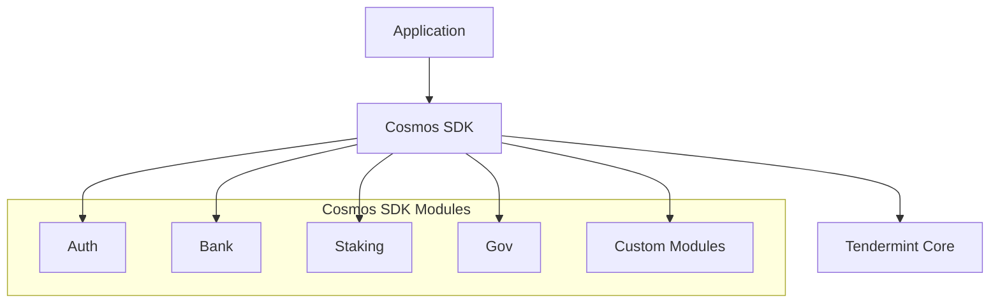

# Cosmos SDK

:::caution 🚧 Docs under construction
Comprehensive SDK documentation is in progress. We’re publishing sections incrementally—watch [#docs-updates](https://discord.gg/cosmosnetwork) for announcements.
:::

## Quick overview

The Cosmos SDK is a framework for building **application‑specific** blockchains. Unlike virtual‑machine chains, every SDK‑based chain controls its own state machine, governance, and upgrade path.

### Key benefits

- **Modularity** – pick only the components you need.  
- **Sovereignty** – full control over logic and governance.  
- **Performance** – optimise for your app, *or* serve a general-purpose.  
- **Interoperability** – out‑of‑the‑box interchain connectivity.

### Core architecture

## Full guide index *(work in progress)*

### Core concepts

* Application architecture
* Modular framework
* State machine design
* Consensus mechanisms

### Development guides

* Setting up a dev environment
* Creating a custom module
* Integrating UIs
* Testing & best practices

### Network & ops

* Chain creation & genesis  
* Validator / infra operations  
* Chain upgrades  

### Advanced topics

* Inter‑module communication  
* Hooks & middleware  
* Custom ante handlers  
* Cross‑chain interaction  

## Resources

* [Official Cosmos SDK reference](https://docs.cosmos.network/)  
* [Interactive tutorials](https://tutorials.cosmos.network/)  
* [Source code on GitHub](https://github.com/cosmos/cosmos-sdk)  
* [SDK tutorials repo](https://github.com/cosmos/sdk-tutorials)

## Community & support

Community channels are listed on the main [Cosmos docs landing page](../).
