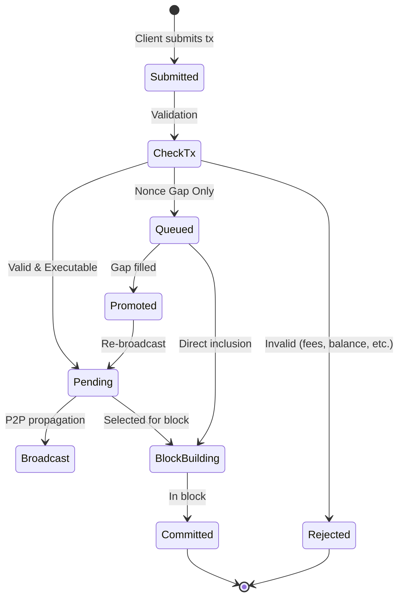

<Warning>
This mempool implementation is **experimental** and under active development. It is intended for testing and evaluation purposes. Use in production environments is **not recommended** without thorough testing and risk assessment.
Please report issues and submit feedback to help improve stability.
</Warning>

## Overview

The EVM mempool is responsible for managing both EVM and Cosmos transactions in a unified pool, enabling Ethereum-compatible transaction flows including out-of-order transactions and nonce gap handling. It serves as a replacement for the default CometBFT FIFO mempool to support Ethereum tooling expectations while maintaining Cosmos SDK compatibility.

The mempool implements a two-tier architecture: a local transaction pool for queuing nonce-gapped transactions and CometBFT broadcasting for executable transactions, preventing network spam while enabling proper EVM transaction semantics.

### Problem Statement

The default CometBFT mempool is incompatible with Ethereum tooling ([Forge](https://getfoundry.sh/), [Hardhat](https://hardhat.org/), [deployment scripts](https://devdocs.optimism.io/op-deployer/reference-guide/custom-deployments.html)) due to fundamental differences in transaction ordering expectations:

1. **FIFO vs Priority Ordering**: CometBFT uses strict FIFO ordering, while Ethereum tools expect fee-based prioritization
2. **Nonce Gap Rejection**: CometBFT immediately rejects out-of-order nonces, while Ethereum tools expect such transactions to queue until executable
3. **Base Fee Dynamics**: Transactions may become temporarily invalid due to base fee increases but should remain in the mempool

Example incompatibility from OP Stack deployment:
```
ERROR unable to publish transaction nonce=39 expected=12: invalid sequence
ERROR unable to publish transaction nonce=40 expected=12: invalid sequence
ERROR unable to publish transaction nonce=41 expected=12: invalid sequence
```

### Design Principles

1. **Instant Finality**: Designed for Cosmos chains with instant finality (no reorgs)
2. **Two-Tier Architecture**: Local queuing + CometBFT broadcasting prevents network spam
3. **Fee-Based Prioritization**: Unified fee comparison between EVM and Cosmos transactions
4. **Ethereum Compatibility**: Supports nonce gaps and transaction queuing semantics

## Concepts

### What Gets Queued vs Rejected

**Queued (Local Storage)**:
- **Nonce gaps**: Transactions with nonce > expected nonce
- These are stored locally and promoted when gaps fill

**Rejected (Immediate Failure)**:
- **Insufficient fees**: `GasFeeCap < BaseFee`
- **Insufficient balance**: Transaction cost exceeds account balance
- **Invalid signature**: Malformed or improperly signed transactions
- **Gas limit exceeded**: Transactions exceeding block gas limit

Only nonce-gapped transactions are intercepted and queued. All other validation failures result in immediate rejection with error returned to the client.

### Dual-Pool Transaction Management

The mempool manages both Cosmos and Ethereum transactions through a unified two-pool system:

#### Transaction Type Routing

**Ethereum Transactions** (`MsgEthereumTx`):
- **Tier 1 (Local)**: EVM TxPool handles nonce gaps and promotion logic
  - Queued state for nonce-gapped transactions (stored locally, not broadcast)
  - Pending state for immediately executable transactions
  - Background promotion when gaps are filled
- **Tier 2 (Network)**: CometBFT mempool broadcasts executable transactions

**Cosmos Transactions** (Bank, Staking, Gov, etc.):
- **Direct to Tier 2**: Always go directly to CometBFT mempool (no local queuing)
- **Standard Flow**: Follow normal Cosmos SDK validation and broadcasting
- **Priority-Based**: Use `PriorityNonceMempool` for fee-based ordering

#### Unified Transaction Selection

During block building, both transaction types compete fairly:
```go
// Simplified selection logic
func SelectTransactions() Iterator {
    evmTxs := GetPendingEVMTransactions()      // From local TxPool
    cosmosTxs := GetPendingCosmosTransactions() // From Cosmos mempool

    return NewUnifiedIterator(evmTxs, cosmosTxs) // Fee-based priority
}
```

**Fee Comparison**:
- **EVM**: `gas_tip_cap` or `gas_fee_cap - base_fee`
- **Cosmos**: `(fee_amount / gas_limit) - base_fee`
- **Winner**: Higher effective tip gets selected first (regardless of type)

This design ensures EVM tooling gets expected nonce gap tolerance while Cosmos transactions maintain standard behavior and network performance is protected from spam.

### Transaction States

- **Pending**: Immediately executable transactions
- **Queued**: Transactions with nonce gaps awaiting prerequisites
- **Promoted**: Background transition from queued to pending

### Fee Prioritization

Transaction selection uses effective tip calculation:
- **EVM**: `gas_tip_cap` or `min(gas_tip_cap, gas_fee_cap - base_fee)`
- **Cosmos**: `(fee_amount / gas_limit) - base_fee`

Higher effective tips are prioritized regardless of transaction type. In the event of a tie, EVM transactions are prioritized.

## Architecture & Transaction Lifecycle

The mempool uses a two-tiered system with local and public transaction pools. The architecture enables Ethereum-compatible transaction handling while maintaining Cosmos SDK compatibility.

<AccordionGroup>

<Accordion title="View Architecture Diagram">


This diagram illustrates the complete EVM mempool architecture, showing:
- **Two-tier system**: Local queuing for nonce-gapped transactions and CometBFT broadcasting for executable ones
- **Transaction routing**: How EVM and Cosmos transactions flow through different paths
- **Component interactions**: The relationship between TxPool, PriorityNonceMempool, and the unified iterator
- **Block building process**: How transactions are selected and prioritized for inclusion
</Accordion>

<Accordion title="Transaction Flow Comparison">


This diagram compares the standard CometBFT mempool flow with the EVM mempool implementation, highlighting the key differences in transaction handling and queuing behavior.
</Accordion>

</AccordionGroup>

### Core Components

#### ExperimentalEVMMempool

The main coordinator implementing Cosmos SDK's `ExtMempool` interface.

**Location**: `mempool/mempool.go`

**Methods**:
- `Insert(ctx, tx)`: Routes transactions to appropriate pools
- `Select(ctx, filter)`: Returns unified iterator over all transactions
- `Remove(tx)`: Handles transaction removal with EVM-specific logic
- `InsertInvalidNonce(txBytes)`: Queues nonce-gapped EVM transactions without broadcasting

#### TxPool

Ethereum transaction pool forked from go-ethereum v1.15.11 with Cosmos adaptations.

**Location**: `mempool/txpool/`

**Modifications**:
- Uses `vm.StateDB` interface instead of go-ethereum's StateDB
- Implements `BroadcastTxFn` callback for transaction promotion
- Cosmos-specific reset logic for instant finality

**Subpools**: Currently uses only `LegacyPool` for standard EVM transactions

#### PriorityNonceMempool

Standard Cosmos SDK mempool for handling non-EVM transactions with fee-based prioritization.

**Features**:
- Fee-based transaction prioritization using configurable priority functions
- Standard Cosmos nonce validation (strict sequential ordering)
- Direct integration with CometBFT broadcasting (no local queuing)
- Compatible with all existing Cosmos SDK transaction types

#### CheckTx Handler

Customizes transaction validation to handle nonce gaps specially.

**Location**: `mempool/check_tx.go`

**Special Handling**: On `ErrNonceGap` for EVM transactions, attempts `InsertInvalidNonce()` and returns success via RPC to prevent client errors

#### Iterator

Unified iterator combining EVM and Cosmos transaction streams.

**Location**: `mempool/iterator.go`

**Selection Logic**:
```go
func (i *EVMMempoolIterator) shouldUseEVM() bool {
    // 1. Availability check
    // 2. Fee comparison: effective_tip_evm vs effective_tip_cosmos
    // 3. EVM preferred on ties or invalid Cosmos fees
}
```

## Transaction Flow

### 1. Transaction Submission
Users or other nodes submit transactions to the chain via JSON-RPC or P2P.

### 2. CometBFT Reception
CometBFT receives the transactions and validates them in the app using CheckTx.

### 3. CheckTx Routing

The CheckTx handler processes transactions with special handling for nonce gaps:

**Success Path** - Immediately executable transactions proceed to the Comet mempool:
```go
// Transaction with correct nonce passes validation
if txNonce == accountNonce {
    // Proceed to Comet mempool for broadcast
    return success
}
```

**Nonce Gap** - Transactions with future nonces are intercepted and queued locally:
```go
if txNonce > accountNonce {
    // Detected nonce gap
    if errors.Is(err, ErrNonceGap) {
        // Route to local queue instead of rejecting
        err := mempool.InsertInvalidNonce(request.Tx)
        // Note: Must intercept error and return success to EVM client
        return interceptedSuccess
    }
}
```

**Other Failures** - Rejected and return error to client:
- **Insufficient fees**: Transactions with `GasFeeCap < BaseFee` fail with `ErrInsufficientFee`
- **Insufficient balance**: Transactions exceeding account balance
- **Invalid signature**: Malformed or invalid transaction signatures

Note: Only nonce gaps trigger local queuing. Fee-related failures result in immediate rejection.

### 4. Comet Mempool Addition
Successfully validated transactions are added to the Comet mempool (FIFO).

### 5. P2P Broadcast
Transactions in the Comet mempool are broadcast to other peers across the network.

### 6. Block Building
When a validator is selected to propose a block, ProcessProposal uses the mempool to build blocks:
- Sorts transactions by account (fee priority) and nonce
- Pulls from both local queue and public pool
- Replaces lower-fee duplicates with higher-fee versions

### 7. Automatic Promotion
The node periodically scans the local queue and promotes transactions when:
- Nonce gaps are filled (either in mempool or from on-chain state)
- Promoted transactions are re-broadcast to the network

## Transaction States



## JSON-RPC API

The mempool extends RPC functionality through the `/txpool` namespace compatible with go-ethereum. These methods are publicly exposed via the JSON-RPC interface on port 8545:

<AccordionGroup>

<Accordion title="txpool_status">
Returns pool statistics (pending/queued transaction counts).

**Shell Example**
```shell
curl -X POST -H "Content-Type: application/json" \
  --data '{"method":"txpool_status","params":[],"id":1,"jsonrpc":"2.0"}' \
  http://localhost:8545
```

**Response**
```json
{
  "jsonrpc": "2.0",
  "id": 1,
  "result": {
    "pending": "0x10",  // 16 pending transactions
    "queued": "0x5"     // 5 queued transactions
  }
}
```
</Accordion>

<Accordion title="txpool_content">
Returns all pending and queued transactions grouped by account.

**Shell Example**
```shell
curl -X POST -H "Content-Type: application/json" \
  --data '{"method":"txpool_content","params":[],"id":1,"jsonrpc":"2.0"}' \
  http://localhost:8545
```

**Request**
```json
{
  "jsonrpc": "2.0",
  "method": "txpool_content",
  "params": [],
  "id": 1
}
```

**Response**
```json
{
  "jsonrpc": "2.0",
  "id": 1,
  "result": {
    "pending": {
      "0x1234...": {
        "100": { /* transaction object */ },
        "101": { /* transaction object */ }
      }
    },
    "queued": {
      "0x5678...": {
        "103": { /* transaction object */ }
      }
    }
  }
}
```

- `pending`: Transactions ready for inclusion in the next block
- `queued`: Valid transactions waiting for nonce gaps to be filled
</Accordion>

<Accordion title="txpool_contentFrom">
Returns transactions for a specific address.

**Shell Example**
```shell
curl -X POST -H "Content-Type: application/json" \
  --data '{"method":"txpool_contentFrom","params":["0x1234567890abcdef1234567890abcdef12345678"],"id":1,"jsonrpc":"2.0"}' \
  http://localhost:8545
```

**Request**
```json
{
  "jsonrpc": "2.0",
  "method": "txpool_contentFrom",
  "params": ["0x1234567890abcdef1234567890abcdef12345678"],
  "id": 1
}
```

**Response**
```json
{
  "jsonrpc": "2.0",
  "id": 1,
  "result": {
    "pending": {
      "100": { /* transaction object */ },
      "101": { /* transaction object */ }
    },
    "queued": {
      "103": { /* transaction object */ }
    }
  }
}
```
</Accordion>

<Accordion title="txpool_inspect">
Returns a human-readable summary of all transactions.

**Shell Example**
```shell
curl -X POST -H "Content-Type: application/json" \
  --data '{"method":"txpool_inspect","params":[],"id":1,"jsonrpc":"2.0"}' \
  http://localhost:8545
```

**Request**
```json
{
  "jsonrpc": "2.0",
  "method": "txpool_inspect",
  "params": [],
  "id": 1
}
```

**Response**
```json
{
  "jsonrpc": "2.0",
  "id": 1,
  "result": {
    "pending": {
      "0x1234...": {
        "100": "0x5678...: 1000 wei + 21000 gas × 20 gwei",
        "101": "contract creation: 0 wei + 100000 gas × 20 gwei"
      }
    },
    "queued": {
      "0x5678...": {
        "103": "0x9abc...: 2000 wei + 21000 gas × 25 gwei"
      }
    }
  }
}
```

**Format**: `<to>: <value> wei + <gas> gas × <gasPrice> wei`
</Accordion>

</AccordionGroup>

## Usage Examples

### Batch Transaction Submission

```javascript
// Ethereum tooling sends multiple transactions
await wallet.sendTransaction({nonce: 100, ...}); // OK: Immediate execution
await wallet.sendTransaction({nonce: 101, ...}); // OK: Immediate execution
await wallet.sendTransaction({nonce: 103, ...}); // OK: Queued locally (gap)
await wallet.sendTransaction({nonce: 102, ...}); // OK: Fills gap, both execute
```

### Transaction Replacement

```javascript
// Speed up transaction with same nonce, higher fee
const tx1 = await wallet.sendTransaction({
  nonce: 100,
  gasPrice: parseUnits("20", "gwei")
});

// Replace with higher fee
const tx2 = await wallet.sendTransaction({
  nonce: 100, // Same nonce
  gasPrice: parseUnits("30", "gwei") // Higher fee
});
// tx1 is replaced by tx2
```

## Implementation Notes

### State Management

The mempool module maintains the following state:

1. **EVM Transaction Pool**: Managed by forked go-ethereum txpool
   - Pending transactions (immediately executable)
   - Queued transactions (nonce gaps)
   - Account nonces and balances via StateDB interface

2. **Cosmos Transaction Pool**: Standard Cosmos SDK priority mempool
   - Priority-based transaction ordering
   - Fee-based prioritization

3. **Block Height**: Requires block 1+ before accepting transactions

### Real-World Testing

The [`tests/systemtests/Counter/script/SimpleSends.s.sol`](https://github.com/cosmos/evm/blob/main/tests/systemtests/Counter/script/SimpleSends.s.sol) script demonstrates typical Ethereum tooling behavior - it sends 10 sequential transactions in a batch, which naturally arrive out of order and create nonce gaps. With the default Cosmos mempool, this script would fail with sequence errors. With the EVM mempool, all transactions are queued locally and promoted as gaps are filled, allowing the script to succeed.