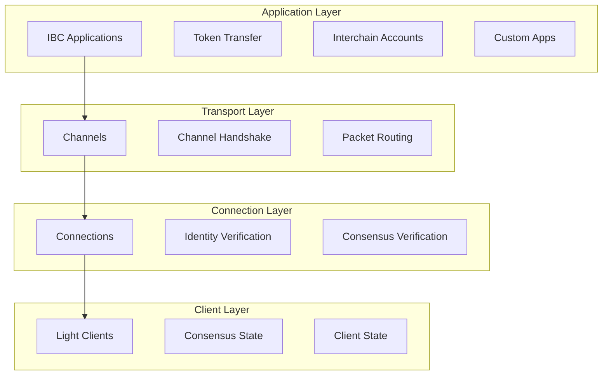
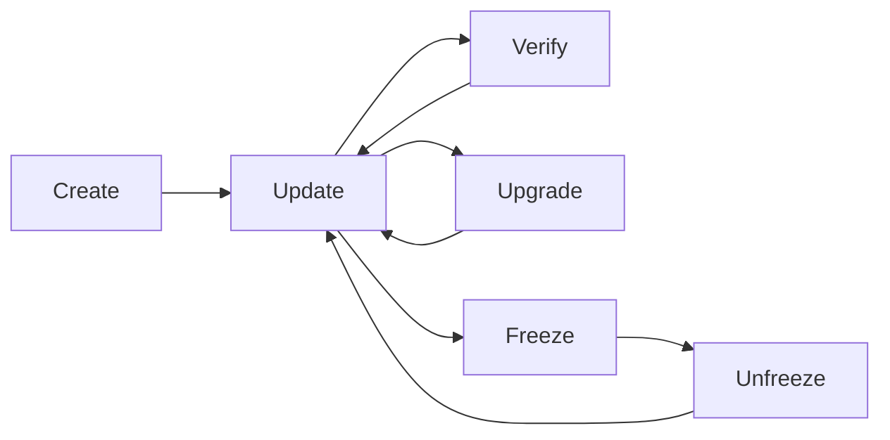
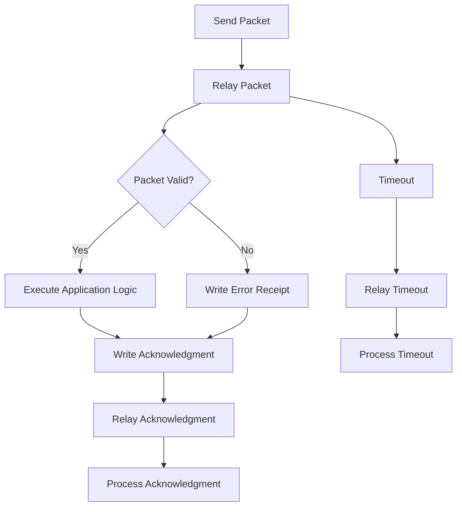

# IBC Core Concepts

Understanding IBC requires grasping four fundamental components that work together to enable secure cross-chain communication. Think of these as the layers of a communication protocol stack.

## The IBC Stack



## 1. Light Clients

Light clients are the foundation of IBC's trustless design. They track the consensus state of counterparty chains without requiring full nodes.

### What Light Clients Do

<div className="grid md:grid-cols-2 gap-6 my-6">
  <div className="p-6 border border-blue-200 dark:border-blue-800 rounded-lg bg-blue-50 dark:bg-blue-900/20">
    <h3 className="text-lg font-semibold mb-3 text-blue-900 dark:text-blue-100">State Tracking</h3>
    <ul className="space-y-2 text-blue-800 dark:text-blue-200">
      <li>• Monitor consensus of remote chains</li>
      <li>• Verify block headers and validator sets</li>
      <li>• Track commitment roots for state proofs</li>
      <li>• Handle chain upgrades and forks</li>
    </ul>
  </div>
  
  <div className="p-6 border border-green-200 dark:border-green-800 rounded-lg bg-green-50 dark:bg-green-900/20">
    <h3 className="text-lg font-semibold mb-3 text-green-900 dark:text-green-100">Verification</h3>
    <ul className="space-y-2 text-green-800 dark:text-green-200">
      <li>• Validate Merkle proofs of remote state</li>
      <li>• Ensure packet data integrity</li>
      <li>• Prevent double-spending attacks</li>
      <li>• Verify timeout conditions</li>
    </ul>
  </div>
</div>

### Client Types

**Tendermint Light Clients**
- Used for Cosmos SDK chains
- Track Tendermint consensus
- Efficient header verification

**Solo Machine Clients**
- For single-key controlled chains
- Simplified consensus mechanism
- Used for testing and specialized applications

**Localhost Clients**
- For same-chain communication
- Zero latency verification
- Useful for testing and local applications

### Client Lifecycle



## 2. Connections

Connections establish the identity and authentication between two chains. They provide the foundation for creating channels.

### Connection Handshake

The connection handshake is a 4-step process:

<div className="space-y-4 my-6">
  <div className="flex items-start space-x-4 p-4 border border-gray-200 dark:border-gray-700 rounded-lg">
    <div className="w-8 h-8 bg-blue-500 text-white rounded-full flex items-center justify-center text-sm font-bold">1</div>
    <div>
      <h4 className="font-semibold">ConnOpenInit</h4>
      <p className="text-sm text-gray-600 dark:text-gray-400">Chain A initializes a connection to Chain B</p>
    </div>
  </div>
  
  <div className="flex items-start space-x-4 p-4 border border-gray-200 dark:border-gray-700 rounded-lg">
    <div className="w-8 h-8 bg-green-500 text-white rounded-full flex items-center justify-center text-sm font-bold">2</div>
    <div>
      <h4 className="font-semibold">ConnOpenTry</h4>
      <p className="text-sm text-gray-600 dark:text-gray-400">Chain B accepts the connection and provides its information</p>
    </div>
  </div>
  
  <div className="flex items-start space-x-4 p-4 border border-gray-200 dark:border-gray-700 rounded-lg">
    <div className="w-8 h-8 bg-purple-500 text-white rounded-full flex items-center justify-center text-sm font-bold">3</div>
    <div>
      <h4 className="font-semibold">ConnOpenAck</h4>
      <p className="text-sm text-gray-600 dark:text-gray-400">Chain A acknowledges Chain B's acceptance</p>
    </div>
  </div>
  
  <div className="flex items-start space-x-4 p-4 border border-gray-200 dark:border-gray-700 rounded-lg">
    <div className="w-8 h-8 bg-orange-500 text-white rounded-full flex items-center justify-center text-sm font-bold">4</div>
    <div>
      <h4 className="font-semibold">ConnOpenConfirm</h4>
      <p className="text-sm text-gray-600 dark:text-gray-400">Chain B confirms the connection is established</p>
    </div>
  </div>
</div>

### Connection Properties

```json
{
  "state": "OPEN",
  "counterpartyConnectionId": "connection-123", 
  "clientId": "07-tendermint-456",
  "counterpartyClientId": "07-tendermint-789",
  "delayPeriod": "3600",
  "version": {
    "identifier": "1",
    "features": ["ORDER_ORDERED", "ORDER_UNORDERED"]
  }
}
```

## 3. Channels

Channels are application-specific communication pathways between chains. They provide ordering guarantees and application-level routing.

### Channel Types

<div className="grid md:grid-cols-2 gap-6 my-6">
  <div className="p-6 border border-purple-200 dark:border-purple-800 rounded-lg bg-purple-50 dark:bg-purple-900/20">
    <h3 className="text-lg font-semibold mb-3 text-purple-900 dark:text-purple-100">🔄 Ordered Channels</h3>
    <p className="text-purple-800 dark:text-purple-200 mb-3">
      Packets must be received in the exact order they were sent.
    </p>
    <ul className="text-sm text-purple-700 dark:text-purple-300 space-y-1">
      <li>• Stronger ordering guarantees</li>
      <li>• Head-of-line blocking possible</li>
      <li>• Good for sequential operations</li>
    </ul>
  </div>
  
  <div className="p-6 border border-orange-200 dark:border-orange-800 rounded-lg bg-orange-50 dark:bg-orange-900/20">
    <h3 className="text-lg font-semibold mb-3 text-orange-900 dark:text-orange-100">🌊 Unordered Channels</h3>
    <p className="text-orange-800 dark:text-orange-200 mb-3">
      Packets can be received in any order, providing higher throughput.
    </p>
    <ul className="text-sm text-orange-700 dark:text-orange-300 space-y-1">
      <li>• Higher throughput</li>
      <li>• No head-of-line blocking</li>
      <li>• Most common choice</li>
    </ul>
  </div>
</div>

### Channel Handshake

Similar to connections, channels require a 4-step handshake:

1. **ChanOpenInit** - Initialize channel on source chain
2. **ChanOpenTry** - Accept channel on destination chain  
3. **ChanOpenAck** - Acknowledge channel acceptance
4. **ChanOpenConfirm** - Confirm channel is open

### Channel Identification

Channels are identified by:
- **Port ID**: Application identifier (e.g., "transfer", "icahost")
- **Channel ID**: Unique channel identifier (e.g., "channel-0")
- **Connection Hops**: List of connections the channel uses

## 4. Packets

Packets are the fundamental units of cross-chain communication, containing application data and routing metadata.

### Packet Structure

```json
{
  "sequence": 1,
  "sourcePort": "transfer",
  "sourceChannel": "channel-0", 
  "destinationPort": "transfer",
  "destinationChannel": "channel-5",
  "data": "eyJ0b2tlbnMiOlt7ImRlbm9tIjoi...",
  "timeoutHeight": {
    "revisionNumber": 1,
    "revisionHeight": 1000
  },
  "timeoutTimestamp": 1640995200000000000
}
```

### Packet Lifecycle



### Packet Flow Guarantees

**Exactly-Once Delivery**
- Packets are delivered at most once
- Duplicates are automatically rejected
- Sequence numbers prevent replay attacks

**Timeout Protection**
- All packets have timeout conditions
- Height-based or time-based timeouts
- Prevents packets from being stuck indefinitely

**Acknowledgment System**
- Success or error acknowledgments
- Application-defined acknowledgment data
- Enables complex cross-chain workflows

## Advanced Concepts

### Packet Commitments

When a packet is sent, a commitment is stored:

```
commitment = hash(packet.data + packet.timeoutHeight + packet.timeoutTimestamp)
```

This commitment is used for verification on the destination chain.

### Client Misbehavior

If a light client detects misbehavior (e.g., double-signing), it can be frozen:

- All packets on affected channels are blocked
- Manual intervention required to unfreeze
- Protects against Byzantine behavior

### Upgrade Mechanisms

IBC supports graceful upgrades:

- **Client Upgrades**: Update client algorithms
- **Connection Upgrades**: Modify connection parameters  
- **Channel Upgrades**: Change channel properties

## Putting It All Together

Here's how all components work together for a token transfer:

1. **Setup Phase**:
   - Light clients track both chains
   - Connection established between chains
   - Transfer channel opened

2. **Transfer Phase**:
   - User initiates transfer on Chain A
   - Packet created with transfer data
   - Packet commitment stored on Chain A

3. **Relay Phase**:
   - Relayer observes packet on Chain A
   - Relayer submits packet to Chain B
   - Chain B verifies packet using Chain A's light client

4. **Execution Phase**:
   - Chain B executes transfer logic
   - Tokens minted/unlocked on Chain B
   - Acknowledgment written on Chain B

5. **Completion Phase**:
   - Relayer relays acknowledgment to Chain A
   - Chain A processes acknowledgment
   - Transfer is complete

## Next Steps

Now that you understand IBC concepts:

1. **[Learn about specific applications](/docs/ibc/integration/transfers)** - Token transfers and interchain accounts
2. **[Set up IBC integration](/docs/ibc/integration/setup)** - Add IBC to your blockchain
3. **[Build custom IBC apps](/docs/ibc/integration/custom-apps)** - Create your own cross-chain applications

## Resources

- **[IBC Specification](https://github.com/cosmos/ibc)** - Technical protocol details
- **[IBC-Go Documentation](https://ibc.cosmos.network/)** - Implementation guide
- **[Interchain Standards](https://github.com/cosmos/ibc/tree/master/spec/app)** - Application-level standards