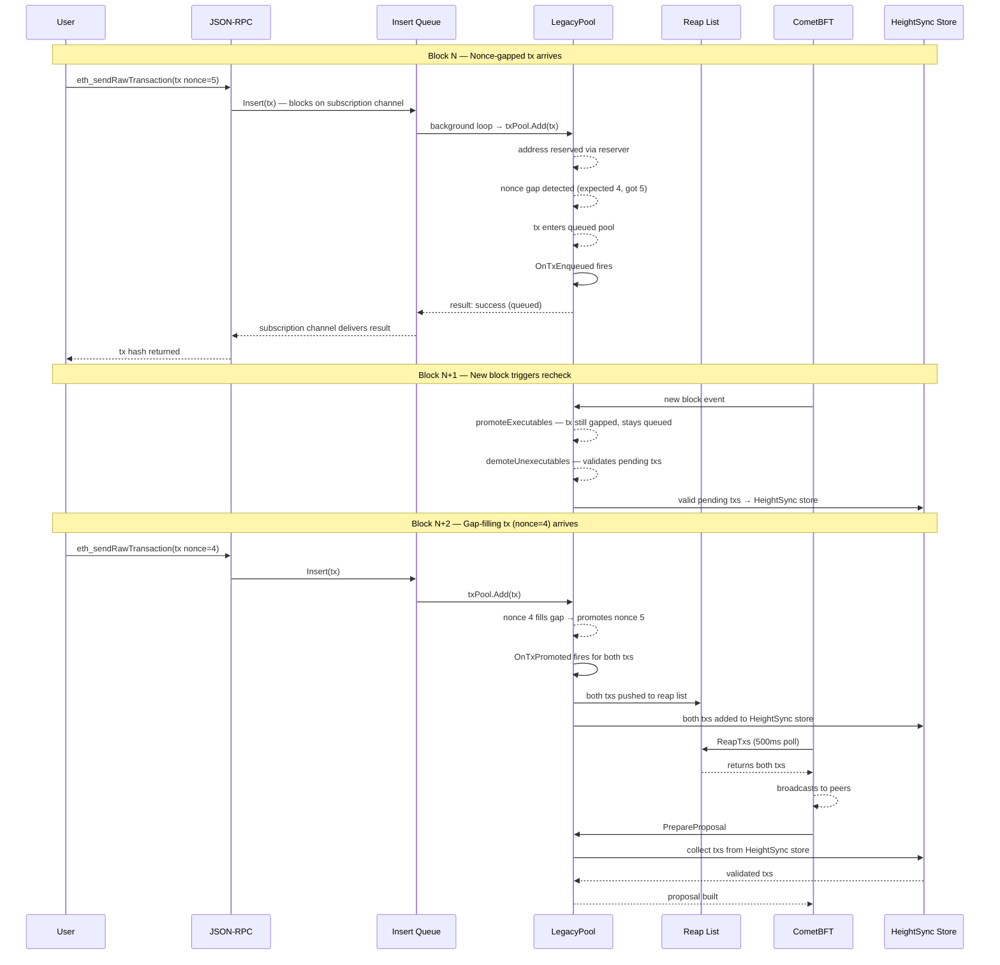
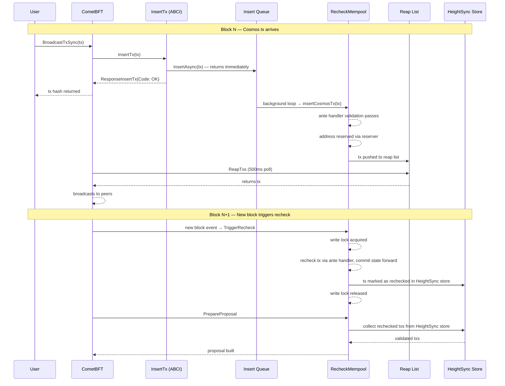

> Experimental: The Krakatoa mempool is an upcoming feature and is subject to change.

## Overview

CometBFT's [Krakatoa specification](/cometbft/v0.38/docs/experimental/krakatoa) introduces a new `app` mempool type that delegates transaction storage, validation, and rechecking to the application via two new ABCI methods: `InsertTx` and `ReapTxs`. This page documents **Cosmos EVM's implementation** of that specification.

The `ExperimentalEVMMempool` is the application-side mempool that fulfills the Krakatoa contract. It manages two sub-pools — an EVM LegacyPool and a Cosmos RecheckMempool — handling transaction insertion, nonce gap queuing, application-side rechecking, and reaping for peer broadcast, all without relying on CometBFT for mempool state.

<Note>
For details on the CometBFT-side changes — the `AppMempool`, `AppReactor`, new ABCI methods, their guarantees, and how to enable your application to take advantage of Krakatoa — see the [CometBFT Krakatoa documentation](/cometbft/v0.38/docs/experimental/krakatoa).
</Note>

## Quick Start

Enabling the Krakatoa mempool requires configuring both CometBFT and `evmd`.

**1. Configure CometBFT** to use the `app` mempool type. See the [CometBFT Krakatoa quick start](/cometbft/next/docs/experimental/krakatoa#quick-start) for details.

**2. Enable `operate-exclusively` on `evmd`** so the application mempool takes full ownership of transaction management.

Via CLI flag:

```bash
evmd start --evm.mempool.operate-exclusively=true
```

Or in `app.toml`:

```toml
[evm.mempool]
operate-exclusively = true
```

When `operate-exclusively` is `true`, `evmd` initializes the Krakatoa mempool and registers the `InsertTx` and `ReapTxs` ABCI handlers. CometBFT **must** be configured with `type = "app"` — if CometBFT is still using the `flood` mempool, the application-side handlers will never be called.

### Key Features

- **Krakatoa ABCI integration**: Implements `InsertTx` and `ReapTxs` handlers, enabling all the advantages of the Krakatoa specification — no ABCI lock contention, application-owned mempool state, and decoupled transaction gossip
  - **Insert queue**: Fully async insertion via background queues, allowing `InsertTx` to return immediately without blocking on pool validation
  - **Reap list**: A staging area that tracks validated transactions and manages which are returned to CometBFT via `ReapTxs` for peer broadcast
- **Application-side rechecking**: Transaction revalidation runs within the application after each block, replacing CometBFT's `CheckTx`-driven recheck pass and giving the application full control over recheck timing and cancellation
- **Non-blocking transaction collection**: A height-aware transaction store allows block builders to collect rechecked transactions as they become available, without waiting for a full recheck pass to complete — enabling proposals to be built from partial recheck results when block time is tight

## Krakatoa ABCI Integration

The `ExperimentalEVMMempool` registers `InsertTx` and `ReapTxs` handlers on BaseApp. Together, these two handlers form the core loop: CometBFT pushes transactions in via `InsertTx`, and pulls validated transactions back out via `ReapTxs` for peer broadcast.

### InsertTx and the Insert Queue

Instead of validating transactions synchronously inside the `InsertTx` ABCI call, the mempool pushes them onto **insert queues** — one for EVM, one for Cosmos. A background goroutine drains each queue, batches the pending items, and inserts them into the underlying pool.

Each queued item carries a **subscription channel** that delivers the insertion result. This supports two calling patterns:

- **Local RPC** (`Insert`): Blocks on the channel, so the caller gets the real result (accepted, queued with nonce gap, or rejected)
- **P2P / ABCI** (`InsertAsync`): Returns immediately — gossip-sourced transactions don't need to wait

```
RPC caller ──Insert──▶ queue.Push(tx) ──▶ background loop ──▶ pool.Add(tx)
                            │                                      │
                            ◀──────── subscription channel ◀───────┘
                            (blocks until result)

P2P peer ──InsertAsync──▶ queue.Push(tx) ──▶ (returns immediately)
```

#### ABCI handler wiring

The ABCI handler wires this up in `evmd`:

```go
func (app *EVMD) NewInsertTxHandler(evmMempool *evmmempool.ExperimentalEVMMempool) sdk.InsertTxHandler {
    return func(req *abci.RequestInsertTx) (*abci.ResponseInsertTx, error) {
        // ... decode tx bytes ...

        code := abci.CodeTypeOK
        if err := evmMempool.InsertAsync(ctx, tx); err != nil {
            switch {
            case errors.Is(err, evmmempool.ErrQueueFull):
                code = abci.CodeTypeRetry   // CometBFT removes from seen cache, will retry
            default:
                code = CodeTypeNoRetry      // permanent rejection
            }
        }
        return &abci.ResponseInsertTx{Code: code}, nil
    }
}
```

### ReapTxs and the Reap List

The **reap list** tracks transactions that are ready for broadcast. It replaces the old `BroadcastTxFn` callback pattern — instead of the application pushing transactions to CometBFT, CometBFT pulls them via `ReapTxs`.

#### Adding transactions

When a transaction enters the reap list depends on its type:

| Transaction type | Added to reap list | Why |
|---|---|---|
| **EVM** | On promotion to pending (`OnTxPromoted`) | Nonce-gapped transactions stay local until their dependencies are satisfied |
| **Cosmos** | Immediately after pool insertion | No queued/pending distinction — ready for broadcast once validated |

#### Removing transactions

Transactions leave the reap list in two ways:

| Path | Trigger | Behavior |
|---|---|---|
| **Reap** (normal) | `AppReactor` calls `ReapTxs` | Drained in FIFO order. Hash stays in the index as a guard to prevent double-broadcasting. |
| **Drop** (invalidation) | `OnTxRemoved` (EVM) or `removeCosmosTx` (Cosmos) | Fully removed from slice and index — if the tx is re-gossiped later, it can re-enter the reap list. |

#### ABCI handler wiring

The `ReapTxsHandler` drains the reap list and returns the encoded bytes:

```go
func (app *EVMD) NewReapTxsHandler(evmMempool *evmmempool.ExperimentalEVMMempool) sdk.ReapTxsHandler {
    return func(req *abci.RequestReapTxs) (*abci.ResponseReapTxs, error) {
        txs, err := evmMempool.ReapNewValidTxs(req.GetMaxBytes(), req.GetMaxGas())
        if err != nil {
            return nil, err
        }
        return &abci.ResponseReapTxs{Txs: txs}, nil
    }
}
```

## Application-Side Rechecking

With Krakatoa, the application rechecks its own mempool after each block — CometBFT no longer drives this via `CheckTx`. Both sub-pools use a `Rechecker` to assist with this that wraps an `sdk.Context` and the ante handler, threading state forward as each transaction is validated.

### EVM Rechecking

On a new block, the LegacyPool runs a two-phase recheck:

1. **`promoteExecutables`** — promotes queued transactions that are now executable. Rechecking does **not** write state back during a block reset, since these will be re-validated next.
2. **`demoteUnexecutables`** — validates all pending transactions on a fresh context, writing state back to the recheck context after each success.

Outside of block processing (e.g., a new tx fills a nonce gap), `promoteExecutables` *does* write state back to the recheck context — it builds on the context `demoteUnexecutables` already established.

### Cosmos Rechecking

Transactions are rechecked in `Select` order, committing state forward. Failed transactions — and dependents from the same account — are removed.

New inserts must validate against post-recheck state, so the pool holds an exclusive lock for the full recheck pass.

### Cancellation

If a new block arrives mid-recheck, the current pass is cancelled and restarted against the new state. Both sub-pools check a cancellation channel between transactions — no partial results are committed.

## Non-Blocking Transaction Collection

Rechecking holds the pool lock, but since Krakatoa removes the ABCI lock, `PrepareProposal` can arrive mid-recheck. We can't block the proposer waiting for a full recheck to finish.

Both pools solve this with a `HeightSync` store — as each transaction passes recheck, it's pushed into a lock-free, height-indexed store. The proposer reads from this store directly:

- **Recheck complete** → proposer gets the full set immediately
- **Recheck in progress** → proposer waits up to a configurable timeout, then takes whatever's been validated so far

This timeout lets operators tune the tradeoff between block fullness and proposal latency. A longer timeout means more transactions in the block but slower proposals; a shorter timeout prioritizes speed at the cost of potentially smaller blocks.

The block builder collects from both the EVM and Cosmos stores to assemble a proposal.

## Address Reservation

Previously, an account could have transactions in both the EVM and Cosmos pools simultaneously. With Krakatoa, this is no longer allowed — a single account can only have transactions in one pool at a time.

Each pool gets its own `ReservationHandle` with a unique ID. The handle's `Hold` method is idempotent within the same pool (holding an already-held address is a no-op) but fails across pools.

### Why

Each pool needs to recheck, insert, and invalidate transactions independently — without consulting the other pool's state. By guaranteeing an address only exists in one pool, each pool can validate and evict transactions in isolation, with no cross-pool coordination required.

## Transaction Lifecycle Diagrams

The following diagrams trace a nonce-gapped EVM transaction through its full lifecycle — from submission through rechecking across multiple blocks.

**Scenario**: Account sends tx with nonce 5, but the pool expects nonce 4. The tx is queued until nonce 4 arrives in a later block.

### Local RPC Submission (`eth_sendRawTransaction`)



### Local RPC Submission — Cosmos tx (`BroadcastTxSync`)



## Related Documentation

- [CometBFT Krakatoa](/cometbft/v0.38/docs/experimental/krakatoa) - AppMempool, ABCI methods, and CometBFT-side architecture
- [Mempool](/evm/next/documentation/concepts/mempool) - Current mempool architecture and configuration
- [Transactions](/evm/next/documentation/concepts/transactions) - Transaction types and lifecycle
- [Gas and Fees](/evm/next/documentation/concepts/gas-and-fees) - Fee calculation and EIP-1559 integration
