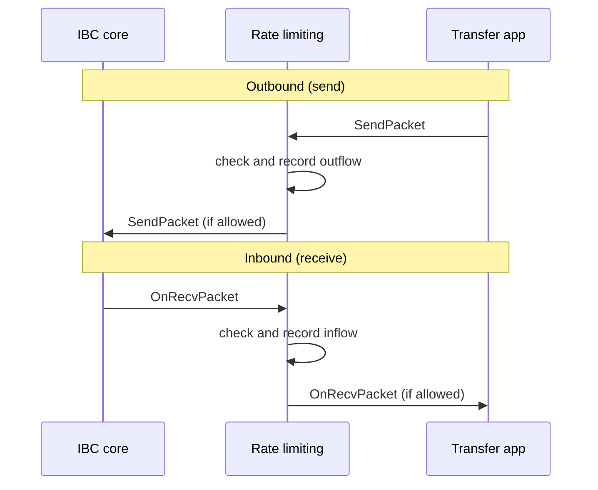

Rate limiting is a governance-configured middleware that caps net token flow across IBC transfers, protecting a chain from draining faster than governance allows. It sits on top of the ICS-20 fungible token transfer application. It measures how much of a token moves over a given path, in each direction, within a rolling time window. When a transfer would push the running total past its configured cap, the middleware rejects it.

To wire it into a chain, see [integrate the rate limiting middleware](/ibc/latest/middleware/rate-limit-middleware/integration). To configure limits through governance, see [configure rate limits](/ibc/latest/middleware/rate-limit-middleware/setting-limits).

## How it works

A rate limit is a ceiling on how much value can leave or enter a chain over one path in one window. When tokens start moving abnormally fast, the limit throttles the flow without freezing normal transfer activity, buying governance time to respond.

The middleware applies to ICS-20 transfers only. Limits are defined and configured independently per pair of denom and path. A path is identified by a channel ID (IBC v1) or a client ID (IBC v2).

Flow limits are set by chain governance.

### Rate limiting and transfers

The middleware wraps the transfer application. Every transfer passes through its accounting before reaching core IBC on the way out or the application on the way in. On a typical chain, the outbound path runs from the transfer module, up through any packet forward middleware, through rate limiting, and finally to the IBC core that sends the packet. The inbound path runs in reverse.



The middleware acts on four points in a packet's life:

- It checks the outflow when a packet is sent.
- It checks the inflow when a packet is received.
- It reverts a recorded outflow when a sent packet fails.
- It reverts a recorded outflow when a sent packet times out.

A blocked outbound transfer fails at the source, so the sender's tokens are never escrowed. A blocked inbound transfer returns an error acknowledgement, so the sending chain refunds its user.

### Quotas, flows, and channel value

Three pieces decide every transfer:

- Quota: the outbound cap, the inbound cap, and the window length.
- Flow: the inflow so far, the outflow so far, and the channel value for this window.
- Channel value: the total on-chain supply of the denom, read from the bank module. It is the denominator that turns a percentage cap into an absolute amount.

The caps are percentages of the channel value. The middleware reads the channel value when the limit is created and again at each window reset, not on every packet. A single window therefore measures flow against a fixed supply figure.

Governance configures the quota fields directly:

```go
type Quota struct {
    MaxPercentSend math.Int // outbound cap as a percent of channel value
    MaxPercentRecv math.Int // inbound cap as a percent of channel value
    DurationHours  uint64   // window length before the flow resets
}
```

The middleware measures net flow, not gross flow:

- Net outflow is the outflow minus the inflow plus the new amount.
- Net inflow is the inflow minus the outflow plus the new amount.

Transfers in the opposite direction free up headroom, so balanced traffic does not throttle a chain that both sends and receives a token.

A transfer is denied when its net flow is strictly greater than the threshold. The threshold is the channel value times the cap percent, divided by 100.

Consider a denom with a total supply of 1,000,000 and a `MaxPercentSend` of 10.

The outbound threshold is 100,000, which is 10% of supply. Suppose the current window has recorded 60,000 of outflow and 20,000 of inflow.

A new outbound transfer is allowed only if the net outflow stays at or below 100,000:

| New send | Net outflow (60,000 - 20,000 + send) | Result |
| --- | --- | --- |
| 70,000 | 110,000 | Denied, exceeds 100,000 |
| 50,000 | 90,000 | Allowed |

### Rolling windows and resets

A flow accumulates within a fixed window and returns to zero when the window elapses. The window length is the quota's duration in hours. The module tracks time as an hourly epoch that advances once per block, and each limit resets when the elapsed epoch count is a multiple of its duration. A limit with a 24-hour duration therefore resets once a day.

A reset does three things:

- It zeroes the inflow and outflow.
- It re-reads the channel value from current supply, so the caps track the token's supply as it changes.
- It clears the record of packets still in flight for that path.

### Reversal on failed acknowledgements and timeouts

An outbound transfer counts against the flow the moment it is sent, before the receiving chain has confirmed it. That count is provisional:

- If the packet is acknowledged successfully, the outflow stands.
- If the acknowledgement carries an error or the packet times out, the middleware reverts the outflow so a failed transfer does not consume the limit.

The reversal is conditional on the window. The middleware reverts an outflow only if the packet was sent during the window that is still open. A packet sent in an earlier window that has already reset is not reverted, because that window's totals are already gone.

### Whitelists and blacklists

Two lists override the quota logic at the edges:

- A whitelist entry is a specific sender and receiver address pair. Transfers between a whitelisted pair skip rate limiting entirely and do not update the flow. This suits trusted or protocol-controlled routes.
- A blacklist entry is a denom. Any transfer of a blacklisted denom is rejected outright, regardless of quota.

The module evaluates a transfer in a fixed order:

1. It rejects a blacklisted denom.
2. It allows any path that has no limit configured.
3. It exempts a whitelisted address pair.
4. It applies the quota.

Whitelist and blacklist entries are set in genesis rather than through governance messages. To configure them, see [configure rate limits](/ibc/latest/middleware/rate-limit-middleware/setting-limits).

## Next steps

- [Integrate the rate limiting middleware](/ibc/latest/middleware/rate-limit-middleware/integration) into a chain for IBC v1 and v2.
- [Configure rate limits](/ibc/latest/middleware/rate-limit-middleware/setting-limits) through governance.
