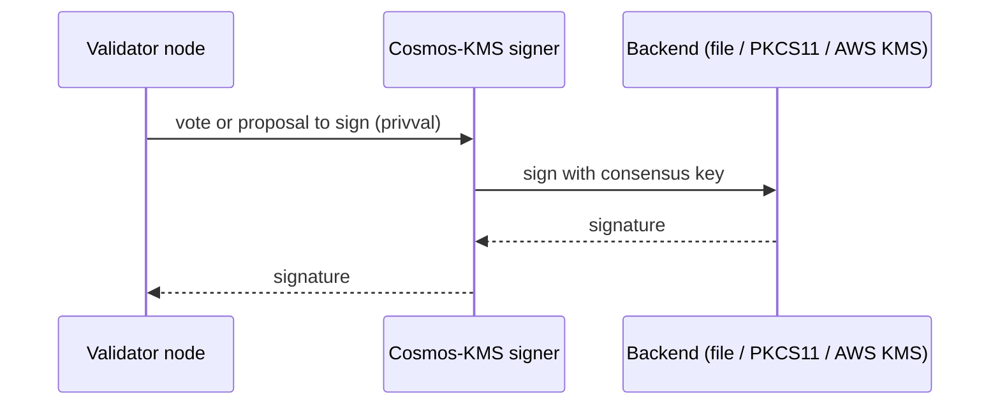

This page covers remote signing for validators and Cosmos-KMS, the Cosmos stack's remote signer. The guides in this section set both up.

## What is remote signing?

Remote signing splits a validator into two processes: a node that participates in consensus, and a signer that holds the consensus key and produces signatures on the node's behalf. The node handles blocks, gossip, and peers; the signer holds the one secret that matters.

Separating the two keeps signing secure and makes the node replaceable. The key moves off the node's exposed filesystem into a hardware security module (HSM) or a cloud key service, where the people and automation that maintain the node never touch it. And because the node holds no secrets, it can be rebuilt, upgraded, or replaced at will. Once it is replaced, the signer reconnects and signing continues.

CometBFT supports this through privval, the seam between the node and whatever holds the key. With `priv_validator_laddr` set in `config.toml`, the node signs nothing locally: it listens for a signer connection and sends each vote and proposal out for signature. The wire protocol carries four requests: sign this vote, sign this proposal, return the public key, and a keepalive ping. The node does not necessarily care what is on the other end.

The node forwards each vote or proposal to the signer over the privval connection. The signer has its backend produce the signature and returns only that, so the consensus key never leaves the backend.

## Cosmos-KMS

The [`cosmos-kms`](https://github.com/cosmos/kms) repo is a remote signer for CometBFT, written in Go. It implements the signer side of privval and answers a node's signing requests from a backend that holds the key. One signer process can sign for multiple chains, with each chain backed by exactly one key, and can hold connections to multiple nodes per chain. It is built for operators who must keep validator keys in real custody, an HSM or a cloud key service, rather than in files on chain infrastructure. Three backends are supported:

- File: a key file on the signer's disk, for development and testing, not production custody.
- PKCS#11: a hardware security module, signing on-device through the standard HSM interface.
- AWS KMS: a key that never leaves AWS KMS, using standard AWS credentials and IAM.

Cosmos-KMS is designed to work with existing validator infrastructure, and validators should prefer it over previous remote-signing solutions. If you run [TMKMS](https://github.com/iqlusioninc/tmkms) today, see [Migrate from TMKMS](/sdk/latest/kms/migrate-from-tmkms).

Cosmos-KMS speaks the CometBFT privval protocol, so it can sign for any node that implements that protocol.

## How it works

A running signer comes down to five moving parts:

- Configuration: one file, `kms.yaml`, in three blocks: the chains it signs for, the validators it dials, and the keys binding each chain to exactly one backend. The `kms init` command scaffolds it; `kms start` serves until stopped.
- Signing: requests travel the privval connection, the backend signs in place, on disk, on the HSM, or inside AWS KMS, and only the signature returns. The private key never crosses the wire.
- Connection: the signer dials out, so the signing host needs no inbound ports. The address scheme selects the transport: `tcp://` uses CometBFT's SecretConnection, and `noise://` adds mutual peer pinning, where each side refuses any connection from an unexpected peer.
- Key types: over privval, the signer signs `ed25519`, `secp256k1eth`, and post-quantum `mldsa65`, plus `secp256k1` on the AWS KMS backend; the gRPC signer service signs `ed25519`, `secp256k1eth`, and `secp256k1`, but not `mldsa65`, which has no gRPC signature scheme and is privval-only. For per-backend support, see [Configure a signing backend](/sdk/latest/kms/configure-backend).
- Double-sign protection: a per-chain last-signed state file refuses anything at or below a height, round, and step already signed. The protection lives with the key, so even a misbehaving or duplicated validator node cannot force a double sign. Because this protection is per state file, it is recommended never to run two signers for the same key. For a backup, connect a single signer to more than one validator node.

## Next steps

- Run a remote signer against a local chain. See [Remote signing tutorial](/sdk/latest/kms/tutorial-file-backend).
- Move the key into real custody, AWS KMS or an HSM. See [Configure a signing backend](/sdk/latest/kms/configure-backend).
- Harden the signer's placement and transport. See [Remote signing best practices](/sdk/latest/kms/best-practices).
- Look up any `kms.yaml` field. See the [configuration reference](/sdk/latest/kms/configuration-reference).
- Understand which key the signer holds and how it rotates. See [Key rotation](/sdk/latest/keys/key-rotation).
- Understand post-quantum consensus keys and their costs. See [Post-quantum keys](/sdk/latest/keys/post-quantum-keys).
