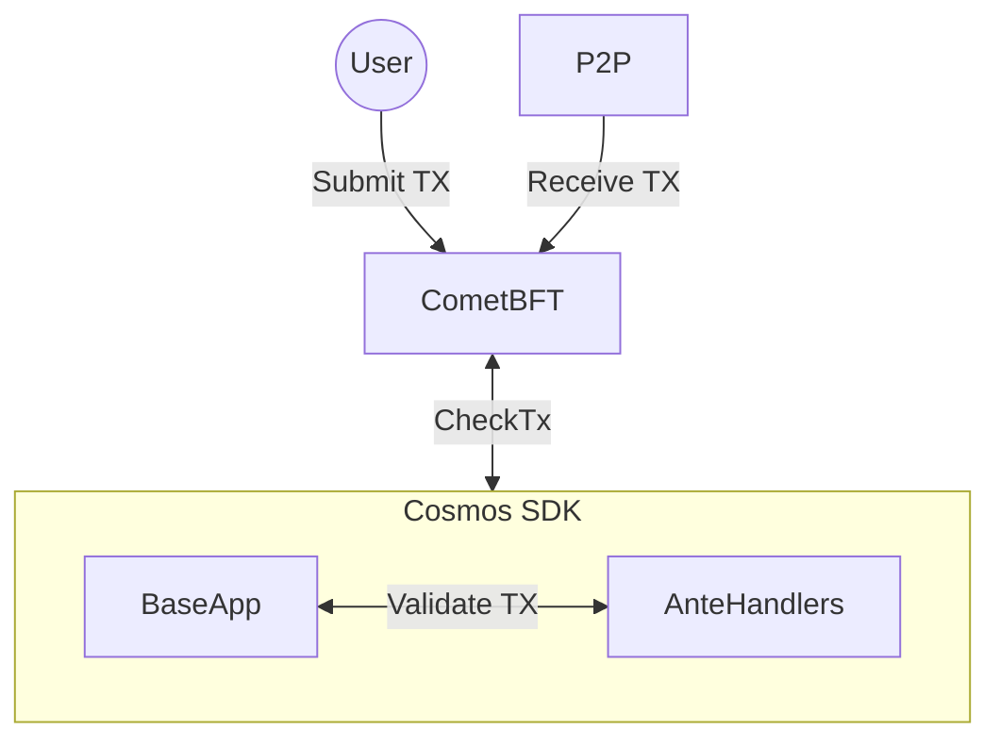

## What is ABCI?

ABCI, Application Blockchain Interface is the interface between CometBFT and the application. More information about ABCI can be found [here](/cometbft/v0.38/spec/abci/Overview). CometBFT version 0.38 introduced ABCI 2.0, which added several new methods:

* `PrepareProposal`
* `ProcessProposal`
* `ExtendVote`
* `VerifyVoteExtension`
* `FinalizeBlock`

The Cosmos SDK's `BaseApp` implements the full ABCI interface. The source lives in [`baseapp/abci.go`](https://github.com/cosmos/cosmos-sdk/blob/release/v0.54.x/baseapp/abci.go).

## CheckTx



`CheckTx` is called by `BaseApp` whenever CometBFT receives a transaction from a client, over the p2p network, or via RPC. Its sole job is to decide whether the transaction is valid enough to enter the mempool. It does not execute messages.

The default implementation runs the transaction through the `AnteHandler` chain, which performs signature verification, fee checks, and other stateless or lightweight stateful validation. If the `AnteHandler` returns an error, the transaction is rejected and never reaches the mempool.

See the implementation at [`baseapp/abci.go`](https://github.com/cosmos/cosmos-sdk/blob/release/v0.54.x/baseapp/abci.go).

### Custom CheckTx handler

`CheckTxHandler` lets you replace the default `CheckTx` logic entirely. The type is defined in [`types/abci.go`](https://github.com/cosmos/cosmos-sdk/blob/release/v0.54.x/types/abci.go):

```go
type CheckTxHandler func(runTx RunTx, req *abci.RequestCheckTx) (*abci.ResponseCheckTx, error)
```

Where `RunTx` is:

```go
type RunTx = func(txBytes []byte, tx Tx) (gInfo GasInfo, result *Result, anteEvents []abci.Event, err error)
```

The handler receives the `runTx` closure from `BaseApp` (bound to the correct execution mode) and the raw ABCI request. It must return deterministic results for the same input bytes.

Register a custom handler from `app.go`:

```go
app.SetCheckTxHandler(myCheckTxHandler)
```

## PrepareProposal

Based on validator voting power, CometBFT selects a block proposer and calls `PrepareProposal` on that validator's application. The proposer collects outstanding transactions from the mempool and returns a proposal to CometBFT.

CometBFT's own mempool uses FIFO ordering. `PrepareProposal` gives the application full control to reorder, drop, or inject transactions before the proposal is sent. For example, an application can inject vote extension data from the previous block as synthetic transactions. What the application does here has no effect on CometBFT's mempool state.

`PrepareProposal` MAY be non-deterministic and is only executed by the current block proposer.

The Cosmos SDK provides `DefaultProposalHandler` in [`baseapp/abci_utils.go`](https://github.com/cosmos/cosmos-sdk/blob/release/v0.54.x/baseapp/abci_utils.go), which selects transactions from the app-side mempool up to `req.MaxTxBytes` and the block gas limit.

<Note>

If you implement a custom `PrepareProposal` handler, the selected transactions MUST NOT exceed the maximum block gas (if set) or `req.MaxTxBytes`.

</Note>

To wire the default handler (or swap in a custom one) from `app.go`:

```go
abciPropHandler := baseapp.NewDefaultProposalHandler(mempool, app)
app.SetPrepareProposal(abciPropHandler.PrepareProposalHandler())
```

Vote extensions are only available at the height after they are enabled. See [Vote Extensions](/sdk/next/build/abci/vote-extensions) for details.

## ProcessProposal

After the block proposer broadcasts a proposal, every validator calls `ProcessProposal` to accept or reject it. The default implementation checks that each transaction decodes correctly and passes the `AnteHandler`.

`ProcessProposal` MUST be deterministic. Non-deterministic results cause apphash mismatches across validators. If the handler panics or returns an error, honest validators prevote nil and CometBFT starts a new round with a new proposal.

See the default implementation in [`baseapp/abci_utils.go`](https://github.com/cosmos/cosmos-sdk/blob/release/v0.54.x/baseapp/abci_utils.go).

To wire a custom handler:

```go
app.SetProcessProposal(myProcessProposalHandler)
```

## ExtendVote and VerifyVoteExtensions

These methods allow applications to extend the voting process by requiring validators to perform additional actions beyond simply validating blocks.

If vote extensions are enabled, `ExtendVote` is called on every validator and each one returns its vote extension — an arbitrary byte slice. This data is only available in the next block height during `PrepareProposal`. Common use cases include prices for a price oracle or encryption shares for an encrypted transaction mempool. `ExtendVote` CAN be non-deterministic.

`VerifyVoteExtension` is called on every validator to verify other validators' vote extensions. It MUST be deterministic.

Applications must keep vote extension data concise, as large extensions degrade chain performance. See the [CometBFT QA results](/cometbft/v0.38/docs/qa/CometBFT-QA-38#vote-extensions-testbed) for benchmarks.

See [Vote Extensions](/sdk/next/build/abci/vote-extensions) for implementation details.

## FinalizeBlock

`FinalizeBlock` is called once consensus is reached on a proposal. It executes all transactions in the block, runs `BeginBlock`/`EndBlock` equivalents, and commits the resulting state. It replaces the old `BeginBlock`, `DeliverTx`, and `EndBlock` methods from ABCI 1.0.

See the implementation at [`baseapp/abci.go`](https://github.com/cosmos/cosmos-sdk/blob/release/v0.54.x/baseapp/abci.go).
